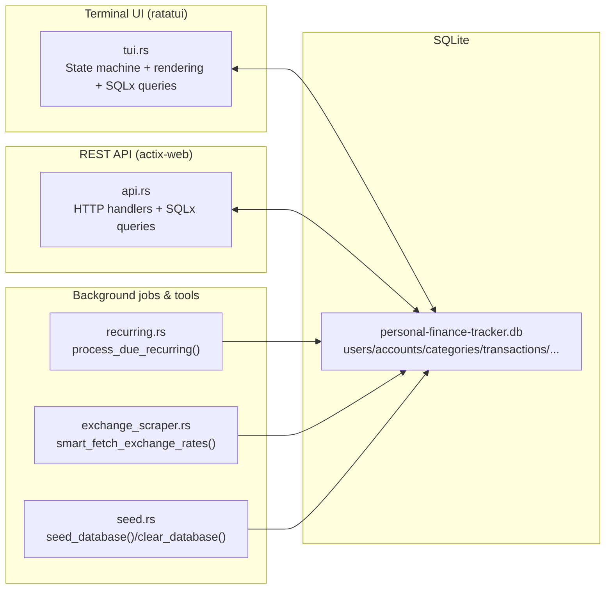

# Personal Finance Tracker - Final Report

## ECE1724 Fall 2025 - Rust Programming Project

---

## Team Members

| Name | Student Number | Email |
|------|----------------|-------|
| Muchen Liu | 1006732145 | muchen.liu@mail.utoronto.ca |
| Ping Shu | 1010506365 | pings.shu@mail.utoronto.ca |
| Ziang Wang | 1006912370 | ziang.wang@mail.utoronto.ca |


## 1. Motivation

### Why Personal Finance Management?

Managing daily finances is a universal challenge faced by students, professionals, and families alike. While numerous financial management tools exist, most are limited by:
- **Paywalls** that restrict access to essential features
- **Mobile-only platforms** that don't integrate with terminal workflows
- **Feature bloat** that makes simple tasks unnecessarily complex
- **Privacy concerns** with cloud-based services handling sensitive financial data

Our team chose to develop a Personal Finance Tracker because managing daily finances is a relatable challenge for many people. Students, professionals, and families all need to track income, expenses, and savings, but existing tools are mostly limited by paywalls, dependent on mobile apps, or overloaded with features that make them complex to use. Our team wants to create a utility that is simple, accessible, and efficient, which is a lightweight command-line finance tracker that anyone can use directly from their terminal.

Our team found this project idea motivating because it combines both personal need for practical usefulness and the opportunity to expand the Rust ecosystem for technical creativity. What excites us most is that this project is practical and fun. It solves real-world problems we face, like logging recurring expenses, understanding where our money goes each month, converting between currencies when travelling around different countries, and managing accounts across different banks. It is also a challenge for us to explore advanced Rust libraries for databases, APIs, and text-based interfaces. This will make the development process rewarding and educational.

From a community perspective, there is a considerable gap in the Rust ecosystem that, although Rust has excellent support for systems programming and web services, there is a lack of finance-focused command-line tools. Most available utilities are written in Python, Java, or C++. By implementing this project in Rust, our team will gain valuable experience with the Rust ecosystem. Nevertheless, this project will contribute a utility that may inspire future Rust developers to explore beyond traditional systems programming.

Generally, the motivation behind our project comes from three main drivers:
- **Practical need** — addressing a real-world problem in personal finance management.
- **Personal satisfaction** — working on a project that is both fun and directly applicable to people’s lives satisfied our team a lot.
- **Community contribution** — filling a gap in Rust’s ecosystem that potentially inspires future applications. 

---

## 2. Objectives
The Object of the Personal Tracker is to use Rust’s guarantees of memory safety, strict type system, and efficient concurrency to perform a Complete, user-friendly, terminal-based financial utility.

Our goal is to develop a practical and user-friendly command-line personal finance tracker that enables users to manage their daily finances across multiple currencies and bank accounts. The tool enables users to log transactions, categorize them, and view their spending patterns over time.

By using a backend server for data storage and integrating real-time exchange rate APIs, we aim to create a system that's both accessible and secure, while providing accurate financial insights regardless of which currencies users work with.

In addition to being a practical tool for everyday use, we aim to explore and demonstrate how Rust can be applied to real-world financial records, competing with JavaScript and Python for mature personal finance ecosystems.
### Specific Goals

1. **Transaction Management**: Enable users to log income and expenses with categorization
2. **Multi-Account Support**: Manage multiple bank accounts, credit cards, and savings accounts
3. **Multi-Currency Support**: Handle transactions in different currencies with real-time exchange rates
4. **Recurring Transactions**: Automate regular expenses like rent, salary, and subscriptions
5. **Financial Insights**: Provide spending analysis and category breakdowns
6. **Data Export**: Allow CSV/JSON export for tax preparation and external analysis
7. **Text-Based Interface**: Build an intuitive TUI using ratatui for terminal users
8. **RESTful API**: Provide a complete API for programmatic access

---

## 3. Features

### High‑level data flow



### 3.1 Core Features

The project’s feature set is intentionally aligned with the **Objectives** (terminal-first workflow, multi-currency support, dual TUI/REST interfaces, and strict reproducibility). Each feature below is included because it directly increases the usefulness of the final deliverable for real personal-finance tracking.

### 1) End-to-end terminal finance workflow 
A complete ledger workflow is available without leaving the terminal:
- **Multi-user profiles**: create, select, and delete users.
- **Accounts**: multiple accounts per user (account type, optional bank name, currency, initial balance).
- **Transactions**: record income/expense transactions with date, description, amount, and optional category.
- **Categories**: define income/expense categories and attach them to transactions.
- **Balance Tracking**: account balances are automatically updated when transactions are created or deleted.

Value: this is the core “finance tracker” objective—an instructor can reproduce a realistic workflow entirely in the TUI.

### 2) Keyboard-driven TUI with safety and productivity 
A Text User Interface (Ratatui) provides a fast, demo-friendly experience:
- **Screen-based navigation**: UserSelect → Dashboard → Accounts → Transactions → Categories → Recurring → FX Rates → Reports → Export.
- **Action-oriented shortcuts**: add/edit/delete entities from the relevant screen; status messages and error feedback are displayed inline.
- **Safe destructive actions**: delete operations use confirmations to reduce accidental data loss.

Value: makes all core features discoverable and testable during a live demo, and enables rapid manual testing without external tooling.

### 3) Recurring transactions engine 
Recurring transactions are first-class, not a “nice-to-have”:
- Create recurring templates with **daily / weekly / monthly / yearly** schedules.
- **Manual processing** in the TUI (useful for demonstrations and controlled testing).
- **Automatic processing** when running the REST server: a background scheduler processes due items **hourly**.

Value: recurring payments (rent, insurance, subscriptions) are a high-frequency real-world need; implementing both manual and scheduled processing shows systems design beyond basic CRUD.

### 4) Multi-currency support with persisted FX rates 
Multi-currency is implemented as a usable workflow rather than a static conversion:
- **FX rate ingestion**: scrape and store exchange rates (50+ currencies; base-currency driven).
- **View-in-currency** in the TUI: display and compare values using a selected currency.
- **Conversion calculator** dialog in the FX Rates screen for quick ad-hoc conversions.

Value: supports international users and cross-border accounts, and demonstrates integration of external data + persistence + UI.

### 5) REST API for programmatic access and integration 
In addition to the TUI, the project can run as a web service (Actix Web):
- CRUD endpoints for **users, accounts, categories, transactions, recurring transactions**.
- Utility endpoints for **processing recurring transactions** (triggered manually via HTTP).
- Read-only endpoints for **analytics** (e.g., spending by category, monthly summaries, top categories).
- Export endpoints for **CSV/JSON** outputs.

Value: enables automated testing, scripting, and future integrations (e.g., importing bank statements, dashboards), while keeping the TUI as the primary UX.

### 6) Built-in reporting and exports 
To support “use the data elsewhere” workflows:
- **Reports**: high-level summaries and category-based breakdowns suitable for quick insights.
- **Exports**: transactions and accounts exportable to **CSV/JSON** for external analysis.

Value: bridges interactive usage and downstream analysis, which is a common expectation for finance tooling.

### 7) Reproducibility utilities 
The repository includes explicit commands to support deterministic evaluation:
- `db_clear` to wipe the database state.
- `db_reseed` to create sample data for quick demos/tests.
- `scrape_rates` to populate FX data in a controlled way.

Value: ensures the instructor can reproduce a known state reliably on both Ubuntu and macOS by following the README verbatim.

### Deletion behavior (important for evaluation)
- Each entity can be deleted individually in the TUI: **accounts**, **transactions**, **categories**, **recurring transactions**, and **exchange rates**.
- Deleting a **user** performs a cascade-style cleanup: all dependent rows are removed first (transactions, recurring transactions, categories, accounts) before deleting the user row.


### 3.2 Other Features

| Feature | Description |
|---------|-------------|
| **Currency Conversion Calculator** | Convert amounts between currencies using live rates |
| **View in Currency (Transactions)** | View all transactions converted to any target currency |
| **View in Currency (Account)** | View account details with all amounts in chosen currency |
| **Intelligent Rate Fallback** | Direct rate → Inverse rate → Multi-currency triangulation (USD/EUR/CAD/GBP) |
| **Exchange Rate Scraping** | Fetch latest rates from X-Rates (4 base currencies: USD, EUR, CAD, GBP × 50+ targets) |
| **Spending Analytics** | Top spending categories with visual bar charts |
| **Account Transaction View** | View all transactions under each account with full details |


---

## 4. User's Guide

### 4.1 Starting the Application

**Start the API server:**
```bash
cargo run serve
```

**Launch the TUI:**
```bash
cargo run tui
```

### 4.2 User Selection Screen

When you launch the TUI, you'll see the user selection screen:

| Key | Action |
|-----|--------|
| `↑/↓` | Navigate between users |
| `Enter` | Login as selected user |
| `a` | Add new user |
| `d` | Delete selected user |
| `q` | Quit application |

### 4.3 Main Navigation (After Login)

Use number keys or arrow keys to switch between tabs:

| Tab | Key | Screen |
|-----|-----|--------|
| 1 | `1` or `←/→` | Dashboard |
| 2 | `2` | Accounts |
| 3 | `3` | Transactions |
| 4 | `4` | Categories |
| 5 | `5` | Recurring |
| 6 | `6` | FX Rates |
| 7 | `7` | Reports |
| 8 | `8` | Export |

### 4.4 Common Actions

| Action | Key | Available On |
|--------|-----|--------------|
| Add item | `a` | Accounts, Transactions, Categories, Recurring, FX Rates |
| Delete item | `d` | Accounts, Transactions, Categories, Recurring, FX Rates |
| View details | `Enter` | Accounts, Transactions, Recurring, FX Rates |
| Filter by currency | `f` | Transactions |
| View in currency | `v` | Transactions, Account Details |
| Refresh data | `r` | All screens |
| Switch user | `u` | All screens |
| Quit | `q` | All screens |
| Cancel/Back | `Esc` | All forms and dialogs |

### 4.5 List Navigation (Cross-Platform)

| Action | Windows/Linux | Mac Alternative |
|--------|--------------|-----------------|
| Move up | `↑` | `↑` |
| Move down | `↓` | `↓` |
| Jump up 10 items | `Page Up` | `[` |
| Jump down 10 items | `Page Down` | `]` |
| Jump to first item | `Home` | `g` |
| Jump to last item | `End` | `G` (Shift+g) |

### 4.6 Adding a Transaction

1. Navigate to **Transactions** (Tab 3)
2. Press `a` to open the add form
3. Fill in fields using `Tab` to move between them:
   - **Account ID**: Select from the list on the right (shows account name and currency)
   - **Amount**: Enter the transaction amount
   - **Type**: Enter `i` for income or `e` for expense
   - **Description**: Brief description of the transaction
   - **Category ID**: Select a category
4. Press `Enter` to submit

### 4.7 Managing Recurring Transactions

1. Navigate to **Recurring** (Tab 5)
2. Available actions:
   - `a` - Add new recurring transaction
   - `p` - Process all due recurring transactions (creates actual transactions)
   - `t` - Toggle active/paused status
   - `d` - Delete recurring transaction

### 4.8 View in Currency (Currency Conversion for Display)

This feature allows you to view all transaction amounts converted to a single currency. The currency selection dialog is **fully scrollable** and shows all 50+ currencies from the exchange rates database.

**On Transactions Screen:**
1. Navigate to **Transactions** (Tab 3)
2. Press `v` to open the View in Currency dialog
3. Use `↑`/`↓` to scroll through currencies, `[`/`]` to jump 10
4. Press `Enter` to select the highlighted currency
5. All transactions will display amounts in the selected currency
6. Original amounts are shown in parentheses

**On Account Details:**
1. Navigate to **Accounts** (Tab 2)
2. Press `Enter` on an account to view details
3. You'll see all transactions for that account listed
4. Press `v` to open the currency selection dialog
5. Scroll with `↑`/`↓` and press `Enter` to select
6. Both balance and transaction amounts will be converted
7. Press `Esc` to exit details (currency resets automatically)

**Note:** Transactions screen and Account Details have **separate currency states** - changing one does not affect the other.

**Currency Selection Dialog Controls:**
| Action | Key |
|--------|-----|
| Scroll up | `↑` |
| Scroll down | `↓` |
| Jump up 10 | `[` |
| Jump down 10 | `]` |
| Select currency | `Enter` |
| Cancel | `Esc` |

The system uses exchange rates from the database, with intelligent fallback:
- Direct rate if available (e.g., USD → CZK)
- Inverse rate (1/rate) if reverse exists (e.g., CZK → USD inverted)
- Multi-currency triangulation via USD, EUR, CAD, or GBP as intermediates

**Technical Details:**
- Exchange rates are loaded with deduplication (only latest rate per currency pair)
- Currency codes are extracted from full names (e.g., "Czech Koruna (CZK)" → "CZK")
- This ensures "USD" matches "US Dollar (USD)" for reliable rate lookup

### 4.9 Currency Conversion Calculator

1. Navigate to **FX Rates** (Tab 6)
2. Press `c` to open conversion dialog
3. Enter:
   - From currency (e.g., `USD`)
   - To currency (e.g., `EUR`)
   - Amount to convert
4. Press `Enter` to see the converted amount

### 4.10 Exporting Data

1. Navigate to **Export** (Tab 8)
2. Press `e` to open export dialog
3. Select format:
   - `1` - Transactions CSV
   - `2` - Transactions JSON
   - `3` - Accounts CSV
   - `4` - Full Summary JSON

---

## 5. Reproducibility Guide

### 5.1 Prerequisites

Ensure you have the following installed:
- **Rust** (1.70 or later) - https://rustup.rs/
- **SQLite3** - `apt install sqlite3` (Ubuntu) or `brew install sqlite3` (macOS)
- **Git** - `apt install git` (Ubuntu) or `brew install git` (macOS)

### 5.2 Clone the Repository

```bash
git clone https://github.com/pingshu-liu/ECE1724RustProject_PersonalFinanceTracker.git
cd ECE1724RustProject_PersonalFinanceTracker
```

### 5.3 Environment Setup

```bash
# Copy environment template
cp .env.example .env

# Edit .env if needed (default values work for local development)
# DATABASE_URL=sqlite:./personal-finance-tracker.db
# BIND_ADDRESS=127.0.0.1:8080
```

### 5.4 Database Setup

```bash
# Install SQLx CLI (for database migrations)
cargo install sqlx-cli --features sqlite

# Create the database file
sqlx database create

# Run migrations to create all tables
sqlx migrate run

# Verify tables were created (optional)
sqlite3 personal-finance-tracker.db ".tables"
# Expected: accounts categories exchange_rates recurring_transactions 
#           transaction_categories transactions users
```

### 5.5 Seed Initial Data (Optional)

```bash 
# Populate database with sample data (users, accounts, transactions)
cargo run db_seed

# Fetch latest exchange rates (scrapes USD, EUR, CAD, GBP as base currencies)
# This creates ~200 exchange rate pairs for currency conversion
cargo run scrape_rates

# Optional: Scrape additional base currency (e.g., JPY)
cargo run scrape_rates JPY
```

**Note:** "cargo run scrape_rates" is not optional to run. Exchange rates are required for the "View in Currency" feature to work correctly. Running `scrape_rates` fetches rates for 4 base currencies, enabling conversion between any of the 50+ supported currencies through direct rates or triangulation.

### 5.6 Build and Run

**Option 1: Run the TUI (Text User Interface)**
```bash
cargo run tui
```

**Option 2: Run the REST API Server**
```bash
cargo run serve
# Server starts at http://127.0.0.1:8080
```

**Option 3: Run both (Recommond)**
```bash
# Terminal 1: Start API server
cargo run serve

# Terminal 2: Start TUI
cargo run tui
```

### 5.7 Verify Installation

After running `cargo run tui`:
1. You should see a user selection screen with 3 sample users (if choosing seed inital data)
2. Select a user and press Enter
3. Navigate through all 8 tabs to verify functionality
4. Try adding a transaction (Tab 3 → press `a`)

### 5.8 Other Useful Commands

```bash
# Clear all data from database
cargo run db_clear

# Clear and reseed database
cargo run db_reseed

# Scrape exchange rates for specific currency
cargo run scrape_rates CAD

# Show help
cargo run help

# Check database status
cargo run db_status
```

### 5.9 API Testing Guide

Start the API server first:
```bash
cargo run serve
# Server runs at http://127.0.0.1:8080
```

#### 5.9.1 User Endpoints

```bash
# List all users (with pagination)
curl "http://localhost:8080/users?page=1&page_size=10"

# Get single user
curl "http://localhost:8080/users/1"

# Create new user
curl -X POST "http://localhost:8080/users" \
  -H "Content-Type: application/json" \
  -d '{"username": "test_user", "email": "test@example.com", "password": "password123"}'

# Update user
curl -X PUT "http://localhost:8080/users/1" \
  -H "Content-Type: application/json" \
  -d '{"username": "updated_name", "email": "updated@example.com"}'

# Delete user
curl -X DELETE "http://localhost:8080/users/1"
```

#### 5.9.2 Account Endpoints

```bash
# List all accounts (with optional user_id filter)
curl "http://localhost:8080/accounts?user_id=1&page=1&page_size=10"

# Get single account
curl "http://localhost:8080/accounts/1"

# Create new account
curl -X POST "http://localhost:8080/accounts" \
  -H "Content-Type: application/json" \
  -d '{
    "user_id": 1,
    "account_name": "My Savings",
    "account_type": "savings",
    "currency": "USD",
    "initial_balance": 1000.00,
    "bank_name": "Chase Bank"
  }'

# Update account
curl -X PUT "http://localhost:8080/accounts/1" \
  -H "Content-Type: application/json" \
  -d '{"account_name": "Updated Account Name", "bank_name": "New Bank"}'

# Delete account
curl -X DELETE "http://localhost:8080/accounts/1"
```

#### 5.9.3 Category Endpoints

```bash
# List all categories (with optional user_id filter)
curl "http://localhost:8080/categories?user_id=1&page=1&page_size=20"

# Get single category
curl "http://localhost:8080/categories/1"

# Create new category
curl -X POST "http://localhost:8080/categories" \
  -H "Content-Type: application/json" \
  -d '{"user_id": 1, "name": "Entertainment"}'

# Update category
curl -X PUT "http://localhost:8080/categories/1" \
  -H "Content-Type: application/json" \
  -d '{"name": "Updated Category Name"}'

# Delete category
curl -X DELETE "http://localhost:8080/categories/1"
```

#### 5.9.4 Transaction Endpoints

```bash
# List transactions (with filters)
curl "http://localhost:8080/transactions?user_id=1&page=1&page_size=20"

# List transactions with date range
curl "http://localhost:8080/transactions?user_id=1&start_date=2024-01-01&end_date=2024-12-31"

# Filter by account
curl "http://localhost:8080/transactions?account_id=1"

# Filter by category
curl "http://localhost:8080/transactions?category_id=5"

# Filter by type (income or expense)
curl "http://localhost:8080/transactions?transaction_type=expense"

# Get single transaction
curl "http://localhost:8080/transactions/1"

# Create new transaction
curl -X POST "http://localhost:8080/transactions" \
  -H "Content-Type: application/json" \
  -d '{
    "account_id": 1,
    "amount": 50.00,
    "transaction_type": "expense",
    "description": "Grocery shopping",
    "category_ids": [6]
  }'

# Update transaction
curl -X PUT "http://localhost:8080/transactions/1" \
  -H "Content-Type: application/json" \
  -d '{"amount": 75.00, "description": "Updated description"}'

# Delete transaction
curl -X DELETE "http://localhost:8080/transactions/1"
```

#### 5.9.5 Recurring Transaction Endpoints

```bash
# List all recurring transactions
curl "http://localhost:8080/recurring-transactions?user_id=1"

# Get single recurring transaction
curl "http://localhost:8080/recurring-transactions/1"

# Create new recurring transaction
curl -X POST "http://localhost:8080/recurring-transactions" \
  -H "Content-Type: application/json" \
  -d '{
    "account_id": 1,
    "amount": 1500.00,
    "transaction_type": "expense",
    "description": "Monthly Rent",
    "category_id": 8,
    "frequency": "monthly",
    "next_occurrence": "2025-01-01T00:00:00Z"
  }'

# Update recurring transaction
curl -X PUT "http://localhost:8080/recurring-transactions/1" \
  -H "Content-Type: application/json" \
  -d '{"amount": 1600.00, "description": "Updated rent"}'

# Toggle active status
curl -X PUT "http://localhost:8080/recurring-transactions/1" \
  -H "Content-Type: application/json" \
  -d '{"is_active": false}'

# Delete recurring transaction
curl -X DELETE "http://localhost:8080/recurring-transactions/1"

# Process all due recurring transactions (creates actual transactions)
curl -X POST "http://localhost:8080/recurring-transactions/process"
```

#### 5.9.6 Exchange Rate Endpoints

```bash
# List all exchange rates (with pagination)
curl "http://localhost:8080/exchange-rates?page=1&page_size=50"

# Filter by currency
curl "http://localhost:8080/exchange-rates?from_currency=USD"

# Get single exchange rate
curl "http://localhost:8080/exchange-rates/1"

# Get latest rates for a base currency
curl "http://localhost:8080/exchange-rates/latest/USD"

# Convert currency amount
curl "http://localhost:8080/exchange-rates/convert?from=USD&to=EUR&amount=100"

# Create new exchange rate
curl -X POST "http://localhost:8080/exchange-rates" \
  -H "Content-Type: application/json" \
  -d '{
    "from_currency": "USD",
    "to_currency": "JPY",
    "rate": 149.50,
    "source": "manual"
  }'

# Update exchange rate
curl -X PUT "http://localhost:8080/exchange-rates/1" \
  -H "Content-Type: application/json" \
  -d '{"rate": 150.25}'

# Delete single exchange rate
curl -X DELETE "http://localhost:8080/exchange-rates/1"

# Bulk delete exchange rates (by criteria)
curl -X DELETE "http://localhost:8080/exchange-rates/bulk?from_currency=USD&source=x-rates"
```

#### 5.9.7 Analytics Endpoints

```bash
# Get spending by category
curl "http://localhost:8080/analytics/spending-by-category?user_id=1"

# Get spending by category with date range
curl "http://localhost:8080/analytics/spending-by-category?user_id=1&start_date=2024-01-01&end_date=2024-12-31"

# Get monthly summary
curl "http://localhost:8080/analytics/monthly-summary?user_id=1"

# Get monthly summary for specific year/month
curl "http://localhost:8080/analytics/monthly-summary?user_id=1&year=2024&month=12"

# Get spending comparison between periods
curl "http://localhost:8080/analytics/spending-comparison?user_id=1&current_start=2024-12-01&current_end=2024-12-31&previous_start=2024-11-01&previous_end=2024-11-30"

# Get top spending categories
curl "http://localhost:8080/analytics/top-categories?user_id=1&limit=5"

# Get top categories with date range
curl "http://localhost:8080/analytics/top-categories?user_id=1&limit=10&start_date=2024-01-01&end_date=2024-12-31"
```

#### 5.9.8 Export Endpoints

```bash
# Export transactions as CSV
curl "http://localhost:8080/export/transactions/csv?user_id=1" -o transactions.csv

# Export transactions with date filter
curl "http://localhost:8080/export/transactions/csv?user_id=1&start_date=2024-01-01&end_date=2024-12-31" -o transactions_2024.csv

# Export transactions as JSON
curl "http://localhost:8080/export/transactions/json?user_id=1" -o transactions.json

# Export accounts as CSV
curl "http://localhost:8080/export/accounts/csv?user_id=1" -o accounts.csv

# Export full summary as JSON (includes accounts, transactions, categories)
curl "http://localhost:8080/export/summary/json?user_id=1" -o summary.json
```

#### 5.9.9 PowerShell Examples (Windows)

For Windows users using PowerShell:

```powershell
# List users
Invoke-RestMethod -Uri "http://localhost:8080/users" | ConvertTo-Json -Depth 5

# Get single user
Invoke-RestMethod -Uri "http://localhost:8080/users/1" | ConvertTo-Json

# Create user
$body = @{
    username = "new_user"
    email = "new@example.com"
    password = "password123"
} | ConvertTo-Json
Invoke-RestMethod -Uri "http://localhost:8080/users" -Method POST -Body $body -ContentType "application/json"

# List transactions
Invoke-RestMethod -Uri "http://localhost:8080/transactions?user_id=1" | ConvertTo-Json -Depth 5

# Convert currency
Invoke-RestMethod -Uri "http://localhost:8080/exchange-rates/convert?from=USD&to=EUR&amount=100" | ConvertTo-Json

# Process recurring transactions
Invoke-RestMethod -Uri "http://localhost:8080/recurring-transactions/process" -Method POST | ConvertTo-Json

# Export to file
Invoke-WebRequest -Uri "http://localhost:8080/export/transactions/csv?user_id=1" -OutFile "transactions.csv"
Invoke-WebRequest -Uri "http://localhost:8080/export/summary/json?user_id=1" -OutFile "summary.json"
```

#### 5.9.10 API Response Format

All API responses follow a consistent format:

**Success Response:**
```json
{
  "success": true,
  "data": { ... },
  "error": null
}
```

**Paginated Response:**
```json
{
  "success": true,
  "data": {
    "items": [ ... ],
    "total": 100,
    "page": 1,
    "page_size": 10,
    "total_pages": 10
  },
  "error": null
}
```

**Error Response:**
```json
{
  "success": false,
  "data": null,
  "error": "Error message here"
}
```

#### 5.9.11 Complete API Endpoint Summary

| Category | Method | Endpoint | Description |
|----------|--------|----------|-------------|
| **Users** | GET | /users | List all users |
| | GET | /users/{id} | Get user by ID |
| | POST | /users | Create new user |
| | PUT | /users/{id} | Update user |
| | DELETE | /users/{id} | Delete user |
| **Accounts** | GET | /accounts | List accounts |
| | GET | /accounts/{id} | Get account by ID |
| | POST | /accounts | Create account |
| | PUT | /accounts/{id} | Update account |
| | DELETE | /accounts/{id} | Delete account |
| **Categories** | GET | /categories | List categories |
| | GET | /categories/{id} | Get category by ID |
| | POST | /categories | Create category |
| | PUT | /categories/{id} | Update category |
| | DELETE | /categories/{id} | Delete category |
| **Transactions** | GET | /transactions | List transactions |
| | GET | /transactions/{id} | Get transaction by ID |
| | POST | /transactions | Create transaction |
| | PUT | /transactions/{id} | Update transaction |
| | DELETE | /transactions/{id} | Delete transaction |
| **Recurring** | GET | /recurring-transactions | List recurring |
| | GET | /recurring-transactions/{id} | Get recurring by ID |
| | POST | /recurring-transactions | Create recurring |
| | PUT | /recurring-transactions/{id} | Update recurring |
| | DELETE | /recurring-transactions/{id} | Delete recurring |
| | POST | /recurring-transactions/process | Process due transactions |
| **Exchange Rates** | GET | /exchange-rates | List rates |
| | GET | /exchange-rates/{id} | Get rate by ID |
| | GET | /exchange-rates/latest/{currency} | Get latest rates |
| | GET | /exchange-rates/convert | Convert amount |
| | POST | /exchange-rates | Create rate |
| | PUT | /exchange-rates/{id} | Update rate |
| | DELETE | /exchange-rates/{id} | Delete rate |
| | DELETE | /exchange-rates/bulk | Bulk delete rates |
| **Analytics** | GET | /analytics/spending-by-category | Category spending |
| | GET | /analytics/monthly-summary | Monthly totals |
| | GET | /analytics/spending-comparison | Period comparison |
| | GET | /analytics/top-categories | Top categories |
| **Export** | GET | /export/transactions/csv | Export CSV |
| | GET | /export/transactions/json | Export JSON |
| | GET | /export/accounts/csv | Export accounts |
| | GET | /export/summary/json | Full summary |

---

## 6. Contributions by Team Member

### Ping Shu

**Primary Responsibilities:**
- Project initialization and Rust project setup
- Database schema design and SQLite integration
- SQLx migrations for all core tables
- RESTful API development
- Exchange rate API integration and web scraping
- Currency conversion logic
- API endpoint documentation
- Seed data creation for testing
- Migration file creation using sqlx-cli
- User documentation and setup guide
- Database structure documentation


### Muchen Liu

**Primary Responsibilities:**
- Error handling and validation implementation
- API testing with Postman
- Recurring transaction endpoints
- Data integrity and error handling validation
- CSV/JSON export functionality
- TUI screens implementation:
  - Transaction entry and viewing
  - Account management screens
  - Reports and spending analysis
  - Settings and configuration
- Developer documentation
- Video presentation and demo creation

### Ziang Wang

**Primary Responsibilities:**
- TUI framework setup with ratatui
- Main navigation and menu system
- Database structure documentation
- Recurring transaction endpoints
- Currency conversion testing
- Export format testing
- TUI to backend API connection
- Final project submission preparation
- Video presentation and demo creation


---

## 7. Lessons Learned and Concluding Remarks
- **Rust ownership + UI state**: building a complex stateful TUI (forms, dialogs, scrolling lists) required careful state design to stay borrow‑checker friendly while keeping the UI responsive.
- **SQLite constraints matter**: foreign key ordering and deletion ordering are critical; we implemented safe delete sequences and (for dev workflows) reset SQLite autoincrement counters.
- **Multi‑currency is deceptively hard**: exchange‑rate data is often incomplete; robust display conversion benefits from inverse lookup and triangulation (we used common intermediates like USD/EUR/CAD/GBP).
- **Two interfaces are complementary**: the TUI optimizes daily personal use, while the REST API enables scripting, testing, and future integrations.

Overall, this project demonstrates a practical, local‑first finance tracker in Rust with a strong emphasis on usability (ratatui), typed persistence (SQLx), and extensibility (REST API + exports).

---

## Appendix: Project Statistics

| Metric | Value |
|--------|-------|
| Lines of Rust Code | ~5,500+ |
| Number of Source Files | 7 |
| Database Tables | 7 |
| API Endpoints | 25+ |
| TUI Screens | 8 |
| TUI Modes | 14 (Normal, AddTransaction, ViewDetails, SelectViewCurrency, etc.) |
| Supported Currencies | 50+ (from FX rates database) |
| Exchange Rate Pairs | ~200 (4 base currencies × 50+ targets, deduplicated) |
| Triangulation Intermediates | 4 (USD, EUR, CAD, GBP) |
| Keyboard Shortcuts | 35+ (cross-platform compatible) |
| Scrollable Dialogs | 2 (Currency Filter, View in Currency) |

### Exchange Rate System Architecture

The exchange rate system is designed for reliability and completeness:

1. **Data Collection**: Scrapes X-Rates.com for 4 base currencies (USD, EUR, CAD, GBP), each providing rates to ~50 target currencies
2. **Smart Loading**: Uses SQL query with GROUP BY to load only the latest rate per currency pair, avoiding duplicates from multiple scrapes
3. **Currency Normalization**: Extracts 3-letter codes from full names (e.g., "Czech Koruna (CZK)" → "CZK") for reliable matching
4. **Flexible Matching**: Compares currencies by code, not string, so "USD" matches "US Dollar (USD)"
5. **Multi-Level Fallback**:
   - Direct rate lookup
   - Inverse rate calculation (1/rate)
   - Triangulation through USD, EUR, CAD, or GBP as intermediates

---

*Final Report - ECE1724 Fall 2025*
*Personal Finance Tracker Team*


# Video Slide Presentation

Please click the link [here](https://youtu.be/pT9dedfG_tY) to watch the presentation video.


# Video Demo

Please click the link [here](https://youtu.be/WEMto95f--w) to watch the video demo.

